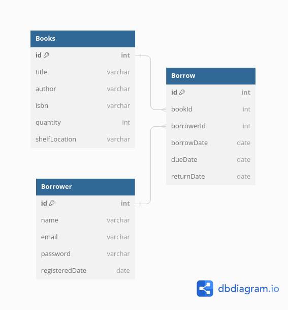

# Library Management System

It's a library management system that allows users to borrow books from the library. It also allows the librarian to add, remove, and update books in the library.

## Table of Contents

-   [Library Management System](#library-management-system)
    -   [Table of Contents](#table-of-contents)
    -   [Introduction](#introduction)
    -   [Features](#features)
    -   [Getting Started](#getting-started)
        -   [Prerequisites](#prerequisites)
        -   [Installation](#installation)
    -   [Usage](#usage)
    -   [API Documentation](#api-documentation)

## Getting Started

### Prerequisites

you need to install the following software:

-   [Docker](https://docs.docker.com/get-docker/)
-   [Docker Compose](https://docs.docker.com/compose/install/)

### Installation

1. Clone the repo

    ```bash
    git clone https://github.com/meldisoukyy/library-management-system
    ```

2. Run the database migrations

    ```bash
    npm run docker:migrate
    ```

3. Run the development server

    ```bash
    npm run docker:dev
    ```

## Usage

You can populate the database with some data by running the following command:

```bash
npm run docker:seed
```

## API Documentation

This section provides a list of all the endpoints available in the API along with their expected inputs and outputs.

## Books

### Get All Books

- **Endpoint:** `GET /books`
- **Description:** Retrieve a list of all books in the library.

### Get Book by ID

- **Endpoint:** `GET /books/:id`
- **Description:** Retrieve a book by its UUID.

### Create a New Book

- **Endpoint:** `POST /books`
- **Description:** Create a new book in the library.

### Update a Book's Details

- **Endpoint:** `PUT /books/:id`
- **Description:** Update the details of a book.

### Delete a Book

- **Endpoint:** `DELETE /books/:id`
- **Description:** Delete a book from the library by its UUID.

### Search for a Book

- **Endpoint:** `GET /books/search`
- **Description:** Search for a book by title, author, or ISBN.

## Borrowers

### Register a Borrower

- **Endpoint:** `POST /borrowers`
- **Description:** Register a new borrower with their details.

### Get All Borrowers

- **Endpoint:** `GET /borrowers`
- **Description:** Retrieve a list of all borrowers.

### Get Borrower by ID

- **Endpoint:** `GET /borrowers/:id`
- **Description:** Retrieve a borrower by their ID.

### Update Borrower's Details

- **Endpoint:** `PUT /borrowers/:id`
- **Description:** Update the details of a borrower.

### Delete Borrower

- **Endpoint:** `DELETE /borrowers/:id`
- **Description:** Delete a borrower by their ID.

## Borrow

### Check Out a Book

- **Endpoint:** `POST /borrow/checkout`
- **Description:** A borrower can check out a book. The system should keep track of which books are checked out and by whom.

### Return a Book

- **Endpoint:** `POST /borrow/return`
- **Description:** A borrower can return a book.

### Get Borrower's Current Books

- **Endpoint:** `GET /borrow/current`
- **Description:** A borrower can check the books they currently have.

### Get Overdue Books

- **Endpoint:** `GET /borrow/overdue`
- **Description:** Retrieve a list of books that are overdue.

## Database Schema


